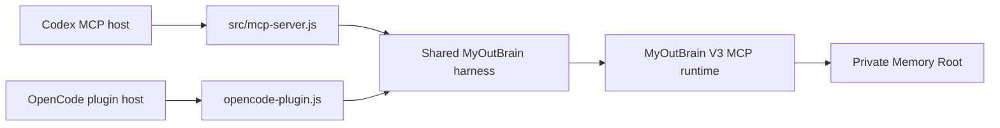

# MyOutBrain V3 Memory Plugin

MyOutBrain V3 是面向 Codex 和 OpenCode 的本地优先记忆插件。它用一层共享 harness 连接 MyOutBrain Memory Graph Authority，并确保用户自己的记忆数据库始终位于仓库之外。

插件不会上传或内置个人记忆。它通过 stdio JSON-RPC，把 Agent 宿主连接到兼容 MyOutBrain Domain Protocol 3.0 的 Authority 运行时。

## V3 的定位

MyOutBrain 的 V1、V2 曾探索更完整的个人记忆系统。V3 将成果收敛为可移植的插件边界：

- Codex 与 OpenCode 共用一套 harness；
- 完整透传 Domain Protocol 3.0 操作；
- 提供 recall、inspection、Collector 与 Review Staging 治理入口；
- 所有审核写操作都要求显式用户决策；
- 插件代码与私有 Memory Root 完全分离。

V1、V2 的失败与设计记录保留在 Git 历史中，当前分支代表独立插件形态的 V3。

## 架构



`src/myoutbrain-harness.js` 统一负责进程启动、MCP 初始化、JSON-RPC 请求关联、协议校验、错误归一化和关闭流程。两个宿主适配器不会各自实现一套记忆逻辑。

## 能力

### 完整网关

`myoutbrain_gateway` 接受完整的 Domain Protocol 3.0 请求，因此 Authority 增加领域操作时，不需要在每个宿主适配器里复制业务逻辑。

### Collector 治理

- 列出 `pending` 与 `deferred` Temporary Knowledge Cards；
- 将混合卡片拆成原子候选；
- 接受、拒绝或暂缓卡片；
- 写操作要求 `explicitUserDecision: true`。

### Review Staging

- 列出待审 graph-change 提案；
- 接受、拒绝或暂缓提案；
- 区分“已进入 Staging”和“已成为 canonical Memory”；
- 应用图变更前要求显式用户决定。

### 共享 Authority

Codex 和 OpenCode 可以指向同一个 Memory Root。Authority 是唯一 canonical writer，适配器不会绕过网关直接读取 SQLite、Vault 或运行时内部文件。

## 环境要求

- Node.js 18 或更高版本；
- Python 3.10 或更高版本；
- 兼容 MyOutBrain V3 的 Python 包或 MCP 命令；
- 一个独立、可写的私有 Memory Root；
- Codex 或 OpenCode。

本仓库包含插件 harness，不包含用户的私有记忆实例。

## 快速开始

### 1. 克隆

```powershell
git clone https://github.com/Devwallem/MyOutBrain.git
cd MyOutBrain
```

Codex MCP 适配器没有 npm 依赖。OpenCode 可选用 `@opencode-ai/plugin`；缺少该模块时会使用内置兼容构造器。

### 2. 配置 Authority

在启动 Agent 宿主的环境中设置：

```powershell
$env:MYOUTBRAIN_MEMORY_ROOT = "D:\Memory\MyOutBrain-private"
$env:MYOUTBRAIN_PYTHON_EXECUTABLE = "python"
```

若 `myoutbrain` 来自源码目录，指定其 package root：

```powershell
$env:MYOUTBRAIN_PACKAGE_ROOT = "D:\src\myoutbrain"
```

也可以覆盖完整命令；harness 会替换 `{memoryRoot}`：

```powershell
$env:MYOUTBRAIN_MCP_COMMAND = '["python","-m","myoutbrain","mcp","--root","{memoryRoot}"]'
```

### 3. 连接 Codex

仓库提供 `.codex-plugin/plugin.json` 与 `.mcp.json`，可直接作为 marketplace 中的 `myoutbrain-memory` 插件源。

本地开发也可以直接注册 MCP Server：

```toml
[mcp_servers.myoutbrain-memory]
command = "node"
args = ["D:\\src\\MyOutBrain\\src\\mcp-server.js"]

[mcp_servers.myoutbrain-memory.env]
MYOUTBRAIN_MEMORY_ROOT = "D:\\Memory\\MyOutBrain-private"
MYOUTBRAIN_PYTHON_EXECUTABLE = "python"
MYOUTBRAIN_PACKAGE_ROOT = "D:\\src\\myoutbrain"
```

修改插件或 MCP 配置后重新启动 Codex。

### 4. 连接 OpenCode

在 `opencode.json` 中注册本地适配器：

```json
{
  "$schema": "https://opencode.ai/config.json",
  "plugin": [
    "file:///D:/src/MyOutBrain/opencode-plugin.js"
  ]
}
```

从包含相同 `MYOUTBRAIN_*` 环境变量的终端启动 OpenCode。适配器会按 Memory Root 复用 harness，并在宿主关闭时回收子进程。

## OIWiki 范例记忆库

完整 OIWiki 范例、SHA-256、安装步骤和 Codex/OpenCode 配置位于：

[Issue #2: OIWiki sample Memory Root for MyOutBrain V3](https://github.com/Devwallem/MyOutBrain/issues/2)

范例库不进入 Git 历史，而是作为 `v3.0.0` Release asset 提供。建议先复制一份再测试写操作。

## 暴露的工具

| Tool | 用途 | 写入保护 |
| --- | --- | --- |
| `myoutbrain_gateway` | 调用任意 Domain Protocol 3.0 操作 | 由领域协议决定 |
| `memory_list_collector_cards` | 列出 Collector 卡片 | 只读 |
| `memory_split_collector_card` | 拆分知识卡片 | 显式决定 |
| `memory_decide_collector_card` | 接受、拒绝或暂缓卡片 | 显式决定 |
| `memory_list_review_proposals` | 列出 Review Staging 提案 | 只读 |
| `memory_decide_review_proposal` | 审议图变更 | 显式决定 |

## 环境变量

| 变量 | 用途 | 默认值 |
| --- | --- | --- |
| `MYOUTBRAIN_MEMORY_ROOT` | 私有 Authority 根目录 | `<host cwd>/.myoutbrain` |
| `MYOUTBRAIN_ROOT` | Memory Root 别名 | 未设置 |
| `MYOUTBRAIN_PYTHON_EXECUTABLE` | Python 启动器 | `python` |
| `MYOUTBRAIN_PACKAGE_ROOT` | 包含 `src/myoutbrain` 的源码根目录 | 尝试自动发现 |
| `MYOUTBRAIN_MCP_COMMAND` | JSON 数组或 shell 风格的完整 MCP 命令 | 自动生成 |
| `MYOUTBRAIN_STARTUP_TIMEOUT_MS` | Authority 启动超时，单位毫秒 | `10000` |

## Domain 请求示例

```json
{
  "protocol": { "major": 3, "minor": 0 },
  "client": {
    "name": "my-agent",
    "capabilities": ["memory-graph.v3"]
  },
  "operation": "review.list",
  "parameters": {}
}
```

写操作应携带稳定的 `idempotency_key`，确保传输重试不会制造重复提案或决定。

## 隐私与安全边界

- 将 `MYOUTBRAIN_MEMORY_ROOT` 放在 Git 仓库之外；
- 不要提交数据库、Vault、导出证据、凭据或未脱敏工具日志；
- 仓库内 `.mcp.json` 不包含机器路径或秘密；
- Collector 接受与 Review Staging 决策要求显式用户批准；
- 候选知识只有经独立审核并接受 graph change 后才成为 canonical Memory；
- harness 只能通过 Authority Gateway 访问私有状态。

## 故障排查

### `Transport closed`

表示 Python MCP 进程退出或初始化失败。依次检查 Python 路径、`myoutbrain` 是否可导入、package root、Memory Root 写权限以及自定义 MCP 命令格式。

### Protocol mismatch

本版本要求 Domain Protocol `3.0`。请升级 Authority，或使用与 Authority 协议一致的插件版本。

### 相对 MCP 路径无法解析

Marketplace 宿主应从插件根目录解析 `./src/mcp-server.js`。直接注册 MCP 时请使用上文所示的绝对路径。

## 仓库结构

```text
.
|-- .codex-plugin/
|   `-- plugin.json
|-- .mcp.json
|-- opencode-plugin.js
|-- package.json
`-- src/
    |-- mcp-server.js
    `-- myoutbrain-harness.js
```

## 版本与贡献

插件遵循语义化版本。V3 对齐 Domain Protocol 3.0，后续插件补丁版本可以在协议兼容的前提下独立演进。

欢迎提交聚焦的 Issue 与 Pull Request。请勿附带私有 Memory Root、数据库、个人证据、访问令牌或未脱敏日志。
